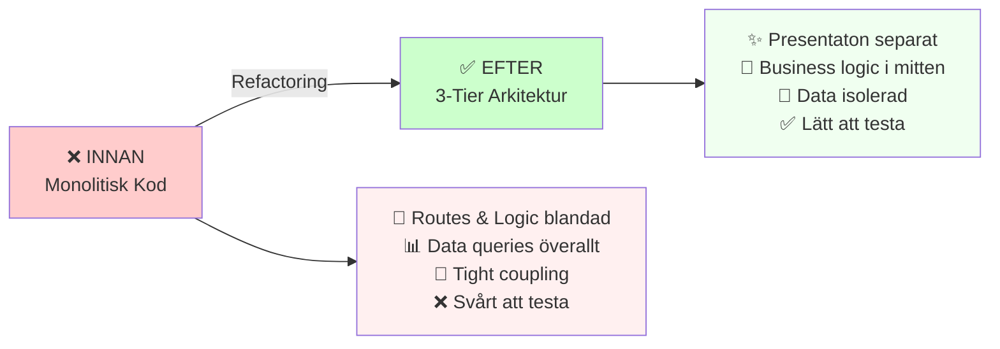
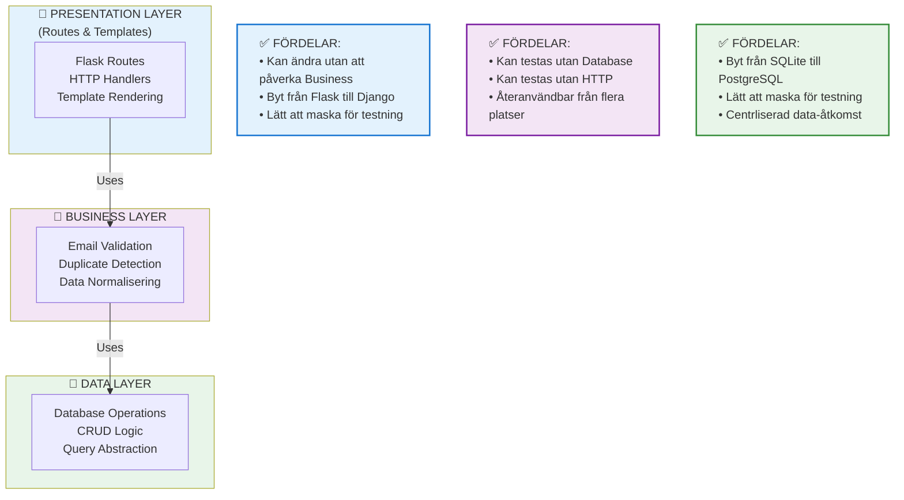
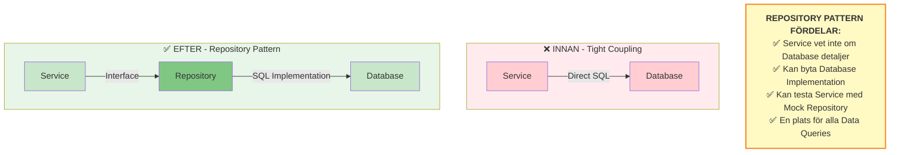
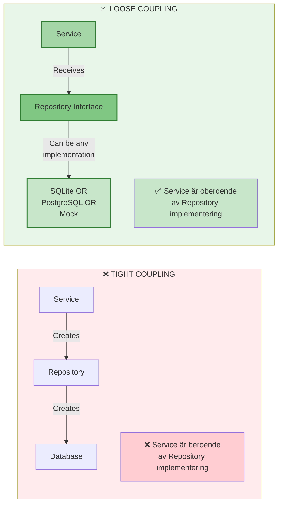
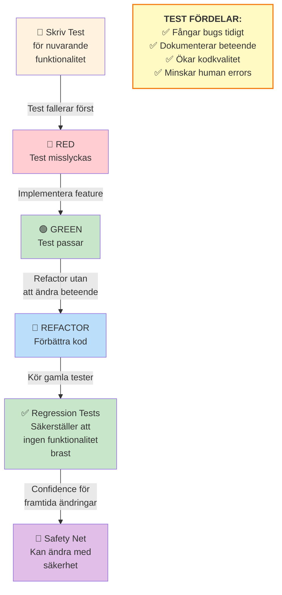
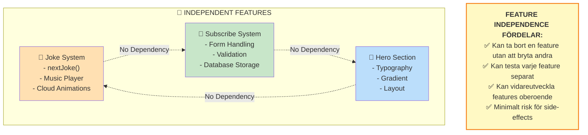
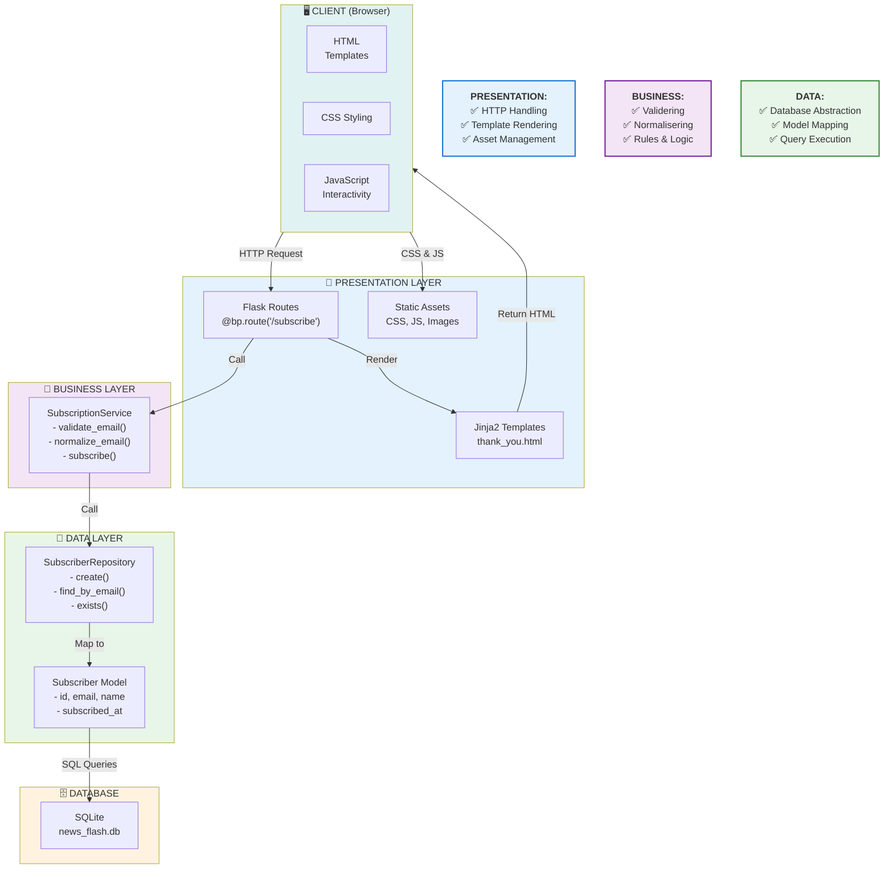
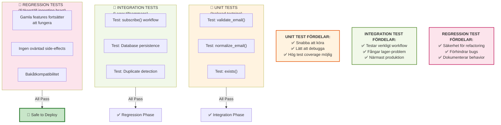
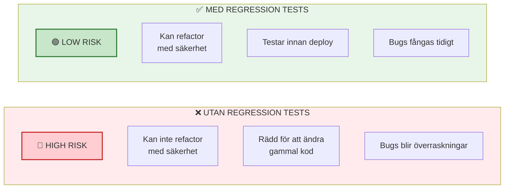

# Architecture & Process Diagram
## Demo-G6 Refactoring, Regression Tests & Independency

---

## 1. Refactoring Process



---

## 2. Independency Layers



---

## 3. Repository Pattern (Data Independency)



---

## 4. Dependency Injection (Loose Coupling)



---

## 5. Regression Testing Cycle



---

## 6. Feature Independence



---

## 7. Complete Architecture Overview



---

## 8. Testing Strategy



---

## 9. Change Confidence Matrix



---

## 10. Development Workflow

```mermaid
graph LR
    A["1️⃣ REFACTOR<br/>Förbättra struktur"] -->|Creates| B["✨ Clean Code<br/>with Clear Layers"]
    
    B -->|Enables| C["2️⃣ INDEPENDENCY<br/>Loose Coupling"]
    
    C -->|Allows| D["🎯 Isolated Testing<br/>Mock & Stub"]
    
    D -->|Requires| E["3️⃣ REGRESSION TESTS<br/>Safety Net"]
    
    E -->|Provides| F["🚀 Confidence<br/>Safe Changes"]
    
    F -->|Leads to| G["📈 QUALITY<br/>Maintainable Code"]
    
    style A fill:#fff3e0
    style C fill:#f3e5f5
    style E fill:#fce4ec
    style B fill:#fff9c4
    style D fill:#e8f5e9
    style F fill:#c8e6c9
    style G fill:#a5d6a7,stroke:#2e7d32,stroke-width:3px
```



---

## Summary Table

| Concept | Problem | Solution | Benefit |
|---------|---------|----------|---------|
| **REFACTORING** | Kod växer, blir svårt att underhålla | 3-Tier Arkitektur, Separation of Concerns | Ren, organiserad kod |
| **INDEPENDENCY** | Ändringar påverkar allt | Loose Coupling, Dependency Injection | Säker, modulär design |
| **REGRESSION TESTS** | Räkna inte på manuell testning | Automatiserade tests för varje feature | Säkerhet för framtida ändringar |

---

## Key Takeaway

```
REFACTORING → INDEPENDENCY → REGRESSION TESTS = QUALITY CODE

✅ Kod som är lätt att förstå
✅ Kod som är lätt att testa  
✅ Kod som är lätt att ändra
✅ Kod som är säker att deploya
```
