# Architecture & Process Diagram
## Demo-G6 Refactoring, Regression Tests & Independency

---

## 1. Refactoring Process

```mermaid
graph LR
    A["❌ INNAN<br/>Monolitisk Kod"] -->|Refactoring| B["✅ EFTER<br/>3-Tier Arkitektur"]
    
    A --> A1["📝 Routes & Logic blandad<br/>📊 Data queries överallt<br/>🔗 Tight coupling<br/>❌ Svårt att testa"]
    
    B --> B1["✨ Presentaton separat<br/>🧠 Business logic i mitten<br/>💾 Data isolerad<br/>✅ Lätt att testa"]
    
    style A fill:#ffcccc
    style B fill:#ccffcc
    style A1 fill:#fff0f0
    style B1 fill:#f0fff0
```



---

## 2. Independency Layers

```mermaid
graph TB
    subgraph Presentation["🎨 PRESENTATION LAYER<br/>(Routes & Templates)"]
        P1["Flask Routes<br/>HTTP Handlers<br/>Template Rendering"]
    end
    
    subgraph Business["🧠 BUSINESS LAYER<br/>(Service)"]
        B1["Email Validation<br/>Duplicate Detection<br/>Data Normalisering"]
    end
    
    subgraph Data["💾 DATA LAYER<br/>(Repository)"]
        D1["Database Operations<br/>CRUD Logic<br/>Query Abstraction"]
    end
    
    P1 -->|Uses| B1
    B1 -->|Uses| D1
    
    P_Benefit["✅ FÖRDELAR:<br/>• Kan ändra utan att påverka Business<br/>• Byt från Flask till Django<br/>• Lätt att maska för testning"]
    B_Benefit["✅ FÖRDELAR:<br/>• Kan testas utan Database<br/>• Kan testas utan HTTP<br/>• Återanvändbar från flera platser"]
    D_Benefit["✅ FÖRDELAR:<br/>• Byt från SQLite till PostgreSQL<br/>• Lätt att maska för testning<br/>• Centrliserad data-åtkomst"]
    
    style Presentation fill:#e3f2fd
    style Business fill:#f3e5f5
    style Data fill:#e8f5e9
    style P_Benefit fill:#e3f2fd,stroke:#1976d2,stroke-width:2px,text-align:left
    style B_Benefit fill:#f3e5f5,stroke:#7b1fa2,stroke-width:2px,text-align:left
    style D_Benefit fill:#e8f5e9,stroke:#388e3c,stroke-width:2px,text-align:left
```



---

## 3. Repository Pattern (Data Independency)


---

## 4. Dependency Injection (Loose Coupling)

```mermaid
graph LR
    subgraph Before["❌ TIGHT COUPLING"]
        S1["Service"]
        S1 -->|Creates| R1["Repository"]
        R1 -->|Creates| DB1["Database"]
        Note1["❌ Service är beroende<br/>av Repository implementering"]
    end
    
    subgraph After["✅ LOOSE COUPLING"]
        S2["Service"]
        S2 -->|Receives| R2["Repository Interface"]
        R2 -->|Can be any<br/>implementation| DB2["SQLite OR<br/>PostgreSQL OR<br/>Mock"]
        Note2["✅ Service är oberoende<br/>av Repository implementering"]
    end
    
    style Before fill:#ffebee
    style After fill:#e8f5e9
    style Note1 fill:#ffcdd2,text-align:center
    style Note2 fill:#c8e6c9,text-align:center
    style S2 fill:#a5d6a7,stroke:#2e7d32,stroke-width:2px
    style R2 fill:#81c784,stroke:#2e7d32,stroke-width:2px
    style DB2 fill:#c8e6c9,stroke:#2e7d32,stroke-width:2px
```



---

## 5. Regression Testing Cycle

```mermaid
graph TD
    A["📝 Skriv Test<br/>för nuvarande<br/>funktionalitet"] -->|Test fallerar först| B["🔴 RED<br/>Test misslyckas"]
    
    B -->|Implementera feature| C["🟢 GREEN<br/>Test passar"]
    
    C -->|Refactor utan<br/>att ändra beteende| D["🔵 REFACTOR<br/>Förbättra kod"]
    
    D -->|Kör gamla tester| E["✅ Regression Tests<br/>Säkerställer att<br/>ingen funktionalitet<br/>brast"]
    
    E -->|Confidence för<br/>framtida ändringar| F["🚀 Safety Net<br/>Kan ändra med<br/>säkerhet"]
    
    Benefits1["<b>TEST FÖRDELAR:</b><br/>✅ Fångar bugs tidigt<br/>✅ Dokumenterar beteende<br/>✅ Ökar kodkvalitet<br/>✅ Minskar human errors"]
    
    style A fill:#fff3e0
    style B fill:#ffcdd2
    style C fill:#c8e6c9
    style D fill:#bbdefb
    style E fill:#c8e6c9
    style F fill:#e1bee7
    style Benefits1 fill:#fff9c4,stroke:#f57f17,stroke-width:2px
```



---

## 6. Feature Independence

```mermaid
graph TB
    subgraph Features["🎯 INDEPENDENT FEATURES"]
        Joke["🤣 Joke System<br/>- nextJoke()<br/>- Music Player<br/>- Cloud Animations"]
        Subscribe["📧 Subscribe System<br/>- Form Handling<br/>- Validation<br/>- Database Storage"]
        Hero["🌟 Hero Section<br/>- Typography<br/>- Gradient<br/>- Layout"]
    end
    
    Benefits["<b>FEATURE INDEPENDENCE FÖRDELAR:</b><br/>✅ Kan ta bort en feature utan att bryta andra<br/>✅ Kan testa varje feature separat<br/>✅ Kan vidareutveckla features oberoende<br/>✅ Minimalt risk för side-effects"]
    
    style Joke fill:#ffe0b2
    style Subscribe fill:#c8e6c9
    style Hero fill:#bbdefb
    style Benefits fill:#fff9c4,stroke:#f57f17,stroke-width:2px
    
    Joke -.->|No Dependency| Subscribe
    Subscribe -.->|No Dependency| Hero
    Hero -.->|No Dependency| Joke
```



---

## 7. Complete Architecture Overview

```mermaid
graph TB
    subgraph Client["🖥️ CLIENT (Browser)"]
        HTML["HTML<br/>Templates"]
        CSS["CSS Styling"]
        JS["JavaScript<br/>Interactivity"]
    end
    
    subgraph Presentation["🎨 PRESENTATION LAYER"]
        Routes["Flask Routes<br/>@bp.route('/subscribe')"]
        Templates["Jinja2 Templates<br/>thank_you.html"]
        Static["Static Assets<br/>CSS, JS, Images"]
    end
    
    subgraph Business["🧠 BUSINESS LAYER"]
        Service["SubscriptionService<br/>- validate_email()<br/>- normalize_email()<br/>- subscribe()"]
    end
    
    subgraph Data["💾 DATA LAYER"]
        Repository["SubscriberRepository<br/>- create()<br/>- find_by_email()<br/>- exists()"]
        Model["Subscriber Model<br/>- id, email, name<br/>- subscribed_at"]
    end
    
    subgraph Database["🗄️ DATABASE"]
        SQLite["SQLite<br/>news_flash.db"]
    end
    
    Client -->|HTTP Request| Routes
    Routes -->|Render| Templates
    Templates -->|Return HTML| Client
    Client -->|CSS & JS| Static
    
    Routes -->|Call| Service
    Service -->|Call| Repository
    Repository -->|Map to| Model
    Model -->|SQL Queries| SQLite
    
    PresentationBenefit["<b>PRESENTATION:</b><br/>✅ HTTP Handling<br/>✅ Template Rendering<br/>✅ Asset Management"]
    BusinessBenefit["<b>BUSINESS:</b><br/>✅ Validering<br/>✅ Normalisering<br/>✅ Rules & Logic"]
    DataBenefit["<b>DATA:</b><br/>✅ Database Abstraction<br/>✅ Model Mapping<br/>✅ Query Execution"]
    
    style Client fill:#e0f2f1
    style Presentation fill:#e3f2fd
    style Business fill:#f3e5f5
    style Data fill:#e8f5e9
    style Database fill:#fff3e0
    
    style PresentationBenefit fill:#e3f2fd,stroke:#1976d2,stroke-width:2px
    style BusinessBenefit fill:#f3e5f5,stroke:#7b1fa2,stroke-width:2px
    style DataBenefit fill:#e8f5e9,stroke:#388e3c,stroke-width:2px
```



---

## 8. Testing Strategy

```mermaid
graph TB
    subgraph UnitTests["🔬 UNIT TESTS<br/>(Isolerad testning)"]
        UT1["Test: validate_email()"]
        UT2["Test: normalize_email()"]
        UT3["Test: exists()"]
    end
    
    subgraph IntegrationTests["🔗 INTEGRATION TESTS<br/>(Lager tillsammans)"]
        IT1["Test: subscribe() workflow"]
        IT2["Test: Database persistence"]
        IT3["Test: Duplicate detection"]
    end
    
    subgraph RegressionTests["🔄 REGRESSION TESTS<br/>(Säkerställ ingenting brast)"]
        RT1["Gamla features fortsätter<br/>att fungera"]
        RT2["Ingen oväntad side-effects"]
        RT3["Bakåtkompatibilitet"]
    end
    
    UnitTests -->|All Pass| Integration["✅ Integration Phase"]
    IntegrationTests -->|All Pass| Regression["✅ Regression Phase"]
    RegressionTests -->|All Pass| Deploy["🚀 Safe to Deploy"]
    
    UnitBenefit["<b>UNIT TEST FÖRDELAR:</b><br/>✅ Snabba att köra<br/>✅ Lätt att debugga<br/>✅ Hög test coverage möjlig"]
    
    IntegrationBenefit["<b>INTEGRATION TEST FÖRDELAR:</b><br/>✅ Testar verkligt workflow<br/>✅ Fångar lager-problem<br/>✅ Närmast produktion"]
    
    RegressionBenefit["<b>REGRESSION TEST FÖRDELAR:</b><br/>✅ Säkerhet för refactoring<br/>✅ Förhindrar bugs<br/>✅ Dokumenterar behavior"]
    
    style UnitTests fill:#fff3e0
    style IntegrationTests fill:#f1f8e9
    style RegressionTests fill:#fce4ec
    style Deploy fill:#c8e6c9,stroke:#2e7d32,stroke-width:3px
    
    style UnitBenefit fill:#fff3e0,stroke:#e65100,stroke-width:2px
    style IntegrationBenefit fill:#f1f8e9,stroke:#558b2f,stroke-width:2px
    style RegressionBenefit fill:#fce4ec,stroke:#c2185b,stroke-width:2px
```



---

## 9. Change Confidence Matrix

```mermaid
graph LR
    subgraph WithoutTests["❌ UTAN REGRESSION TESTS"]
        Risk["🔴 HIGH RISK"]
        Cannot1["Kan inte refactor<br/>med säkerhet"]
        Cannot2["Rädd för att ändra<br/>gammal kod"]
        Cannot3["Bugs blir överraskningar"]
    end
    
    subgraph WithTests["✅ MED REGRESSION TESTS"]
        Safe["🟢 LOW RISK"]
        Can1["Kan refactor<br/>med säkerhet"]
        Can2["Testar innan deploy"]
        Can3["Bugs fångas tidigt"]
    end
    
    style WithoutTests fill:#ffebee
    style WithTests fill:#e8f5e9
    style Risk fill:#ffcdd2,stroke:#c62828,stroke-width:2px
    style Safe fill:#c8e6c9,stroke:#2e7d32,stroke-width:2px
```



---

## 10. Development Workflow

```mermaid
graph LR
    A["1️⃣ REFACTOR<br/>Förbättra struktur"] -->|Creates| B["✨ Clean Code<br/>with Clear Layers"]
    
    B -->|Enables| C["2️⃣ INDEPENDENCY<br/>Loose Coupling"]
    
    C -->|Allows| D["🎯 Isolated Testing<br/>Mock & Stub"]
    
    D -->|Requires| E["3️⃣ REGRESSION TESTS<br/>Safety Net"]
    
    E -->|Provides| F["🚀 Confidence<br/>Safe Changes"]
    
    F -->|Leads to| G["📈 QUALITY<br/>Maintainable Code"]
    
    style A fill:#fff3e0
    style C fill:#f3e5f5
    style E fill:#fce4ec
    style B fill:#fff9c4
    style D fill:#e8f5e9
    style F fill:#c8e6c9
    style G fill:#a5d6a7,stroke:#2e7d32,stroke-width:3px
```



---

## Summary Table

| Concept | Problem | Solution | Benefit |
|---------|---------|----------|---------|
| **REFACTORING** | Kod växer, blir svårt att underhålla | 3-Tier Arkitektur, Separation of Concerns | Ren, organiserad kod |
| **INDEPENDENCY** | Ändringar påverkar allt | Loose Coupling, Dependency Injection | Säker, modulär design |
| **REGRESSION TESTS** | Räkna inte på manuell testning | Automatiserade tests för varje feature | Säkerhet för framtida ändringar |

---

## Key Takeaway

```
REFACTORING → INDEPENDENCY → REGRESSION TESTS = QUALITY CODE

✅ Kod som är lätt att förstå
✅ Kod som är lätt att testa  
✅ Kod som är lätt att ändra
✅ Kod som är säker att deploya
```
