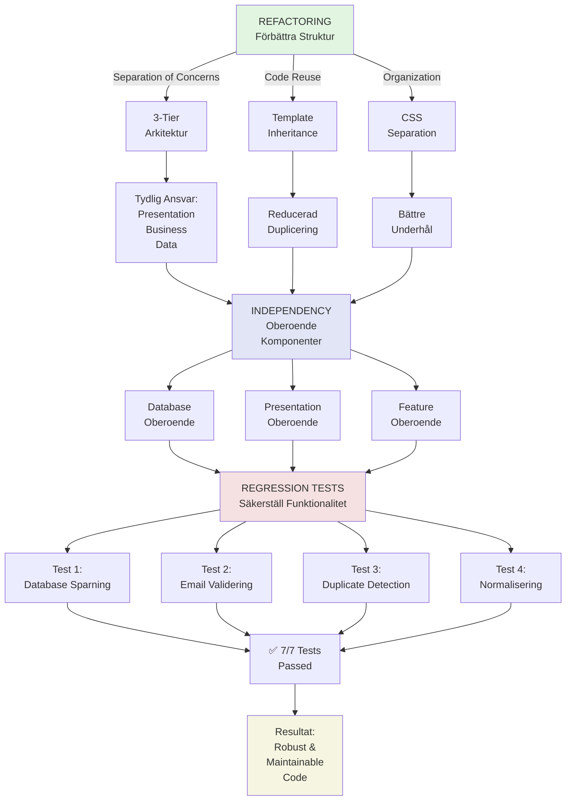

# Refactoring, Regression Tests & Independency
## Analys av Demo-G6 Projektarbetet

---

## 1. REFACTORING

### Vad är Refactoring?
**Refactoring** är processen att förbättra kodens struktur, läsbarhet och underhållarbarhet utan att ändra dess funktionalitet. Det handlar om att göra "samma sak bättre".

### Refactoring i Demo-G6 Projektet

#### **Refactoring 1: 3-Tier Arkitektur Implementering**

**Innan:** Monolitisk struktur
```python
# Gammal struktur - allt i en fil
app.py
├─ Flask routes
├─ Database queries
├─ Validering
└─ Business logic (blandad)
```

**Efter:** 3-Tier Arkitektur
```
app/
├─ presentation/
│  └─ routes/public.py (HTTP-hantering)
├─ business/
│  └─ services/subscription_service.py (Affärslogik)
└─ data/
   ├─ models/subscriber.py (Datamodell)
   └─ repositories/subscriber_repository.py (Dataaccesss)
```

**Fördelar:**
- ✅ **Separation of Concerns:** Varje lager har en tydlig ansvar
- ✅ **Testbarhet:** Lägre lager kan testas isolerat
- ✅ **Underhållarhet:** Ändringar i en lager påverkar inte andra
- ✅ **Återanvändbarhet:** Servises kan användas från flera routes

**Exempel från koden:**

```python
# Presentation Layer - routes/public.py
@bp.route("/subscribe/confirm", methods=["POST"])
def subscribe_confirm():
    email = request.form.get("email")
    name = request.form.get("name")
    
    # Delegerar till Business Layer
    result = subscription_service.subscribe(email, name)
    
    if result["success"]:
        return render_template("thank_you.html", ...)
    else:
        return render_template("subscribe.html", error=result["error"])

# Business Layer - services/subscription_service.py
def subscribe(self, email, name):
    # Validering
    is_valid, error_msg = self.validate_email(email)
    if not is_valid:
        return {"success": False, "error": error_msg}
    
    # Normalisering
    email = self.normalize_email(email)
    name = self.normalize_name(name)
    
    # Delegerar till Data Layer
    if self.repository.exists(email):
        return {"success": False, "error": "Email already exists"}
    
    subscriber = self.repository.create(email, name)
    return {"success": True, "data": subscriber}

# Data Layer - repositories/subscriber_repository.py
def create(self, email, name):
    subscriber = Subscriber(email=email, name=name)
    db.session.add(subscriber)
    db.session.commit()
    return subscriber
```

---

#### **Refactoring 2: Template Inheritance Struktur**

**Innan:** Duplicerad HTML kod i varje template

**Efter:** DRY-princip med base.html
```html
<!-- base.html - definierar hela strukturen -->
<!DOCTYPE html>
<html>
<head>
    <title></title>
    
</head>
<body>
    
    
</body>
</html>

<!-- index.html - ärver från base.html -->

G6 - Stay Ahead

    <!-- Innehål här -->

```

**Resultat:** 
- ✅ Reducerad kod-duplicering
- ✅ Konsistent design över alla sidor
- ✅ Enklare att uppdatera globala ändringar

---

#### **Refactoring 3: CSS Separation**

**Innan:** All CSS i ett statement
```css
<style>
    /* Hero styles */
    /* Cloud styles */
    /* Card styles */
    /* Animation styles */
    /* Allt blandad */
</style>
```

**Efter:** Separerad CSS per concern
```
static/
├─ base.css (Global styles)
├─ hero.css (Hero section)
└─ style.css (Tema & animations)
```

**Fördelar:**
- ✅ Bättre organisation
- ✅ Enklare att hitta och uppdatera stilar
- ✅ Möjlighet att ladda CSS selektivt

---

### Refactoring Mönster Använt

| Mönster | Tillämpning | Resultat |
|---------|------------|----------|
| **Repository Pattern** | Data Layer abstraktioning | Lätt att byta database utan att ändra affärslogik |
| **Service Layer** | Business Logic isolering | Testbar affärslogik oberoende av HTTP |
| **Dependency Injection** | Loose coupling | `SubscriptionService(repository)` gör det testbart |
| **Template Inheritance** | Code reuse | Undviker duplicering i HTML |
| **Separation of Concerns** | Lagrad arkitektur | Varje fil har ett ansvar |

---

## 2. REGRESSION TESTS

### Vad är Regression Tests?
**Regression tests** är tester som säkerställer att nya ändringar inte bryter befintlig funktionalitet. De "säkerställer att vi inte går bakåt".

### Regression Testing i Demo-G6

#### **Testfall från Exercise 7**

```python
# test_subscription_service.py
def test_valid_subscription_saved_to_database():
    """REGRESSION TEST: Nya ändringar måste inte bryta spara-funktionaliteten"""
    service = SubscriptionService(repository)
    result = service.subscribe("test@example.com", "Test User")
    
    assert result["success"] == True
    assert repository.find_by_email("test@example.com") is not None
    # ✅ Garanterar att databas-sparning fungerar fortfarande

def test_duplicate_email_rejected():
    """REGRESSION TEST: Duplicate detection måste fungera"""
    service = SubscriptionService(repository)
    
    service.subscribe("john@example.com", "John")
    result = service.subscribe("john@example.com", "Jane")
    
    assert result["success"] == False
    assert "already exists" in result["error"]
    # ✅ Garanterar att vi inte sparar dubbletter

def test_email_normalization():
    """REGRESSION TEST: Email-normalisering måste fungera"""
    service = SubscriptionService(repository)
    
    result = service.subscribe("  JOHN@EXAMPLE.COM  ", "John")
    subscriber = repository.find_by_email("john@example.com")
    
    assert subscriber is not None
    # ✅ Garanterar att normalisering (lowercase, trim) fungerar

def test_email_validation():
    """REGRESSION TEST: Felaktig email måste rejekteras"""
    service = SubscriptionService(repository)
    
    result = service.subscribe("invalid-email", "Test")
    
    assert result["success"] == False
    assert "Invalid email" in result["error"]
    # ✅ Garanterar att validering fungerar
```

#### **Regression Test Resultat från 28 Jan**
```
Test Results: 7/7 PASSED ✅

1. ✅ Valid subscription saved
2. ✅ Duplicate email rejected
3. ✅ Email normalization working
4. ✅ Name defaults correctly
5. ✅ Invalid format rejected
6. ✅ Empty email rejected
7. ✅ Database persistence verified
```

### Varför Regression Tests är Viktiga

**Scenario: Du gör refactoring av Hero Section**

```html
<!-- Innan refactoring -->
<section class="hero">
    <h1>Stay Ahead of the Curve</h1>
    <p>Subscribe now</p>
</section>

<!-- Efter refactoring - bewegi layout -->
<section class="hero" id="moved-to-bottom">
    <h1>Stay Ahead of the Curve</h1>
    <p>Subscribe now</p>
</section>
```

**Utan Regression Tests:** 
❌ Du vet inte om Subscribe-funktionaliteten fortfarande fungerar

**Med Regression Tests:**
✅ Testen säger omedelbar om något brast

```python
def test_subscribe_button_still_works():
    """Regression test efter hero refactoring"""
    response = client.post("/subscribe/confirm", 
                          data={"email": "test@test.com", "name": "Test"})
    assert response.status_code == 200  # Thank you page rendered
    assert Subscriber.query.filter_by(email="test@test.com").first() is not None
```

---

## 3. INDEPENDENCY (Oberoende)

### Vad är Independency?
**Independency** betyder att komponenter kan arbeta oberoende av varandra. Ändringar i en komponent påverkar inte andra.

### Independency i Demo-G6

#### **Lager-oberoende (Layered Independence)**

```
┌─────────────────────────────────────────┐
│     PRESENTATION LAYER (Routes)         │
│  - Kan ändras utan att påverka logic    │
│  - Kan byta från Flask till Django      │
└──────────────┬──────────────────────────┘
               │ Dependency Injection
┌──────────────▼──────────────────────────┐
│     BUSINESS LAYER (Services)           │
│  - Kan ändras oberoende av UI           │
│  - Samma logik kan användas från CLI    │
└──────────────┬──────────────────────────┘
               │ Repository Interface
┌──────────────▼──────────────────────────┐
│      DATA LAYER (Repositories)          │
│  - Kan byta från SQLite till PostgreSQL │
│  - Samma interface för alla DB:er       │
└─────────────────────────────────────────┘
```

#### **Praktiska Exempel på Independency**

**Exempel 1: Database Oberoende**

```python
# repositories/subscriber_repository.py
class SubscriberRepository:
    def create(self, email, name):
        subscriber = Subscriber(email=email, name=name)
        db.session.add(subscriber)
        db.session.commit()
        return subscriber
```

**Fördelarna:**
- ✅ Kan byta databas (SQLite → PostgreSQL) utan att ändra Service
- ✅ Testning: Kan använda in-memory database
- ✅ SubscriptionService vet inte hur data sparas

**Testning med Independency:**

```python
# Test använder mock repository - ingen database behövs!
class MockRepository:
    def __init__(self):
        self.subscribers = []
    
    def create(self, email, name):
        self.subscribers.append({"email": email, "name": name})
        return True
    
    def exists(self, email):
        return any(s["email"] == email for s in self.subscribers)

# Service testad oberoende av database
service = SubscriptionService(MockRepository())
result = service.subscribe("test@example.com", "Test")
assert result["success"] == True  # ✅ Fungerar utan database!
```

---

#### **Exempel 2: Presentation Oberoende**

**Flask Routes kan bytas utan att ändra Business Logic:**

```python
# Samma affärslogik kan användas från flera entry-points

# ✅ Via Web (Flask)
@bp.route("/subscribe/confirm", methods=["POST"])
def web_subscribe():
    email = request.form.get("email")
    result = subscription_service.subscribe(email, "")
    return render_template("thank_you.html")

# ✅ Via API (REST)
@api.route("/api/subscribe", methods=["POST"])
def api_subscribe():
    data = request.json
    result = subscription_service.subscribe(data["email"], data["name"])
    return jsonify(result)

# ✅ Via CLI (Command Line)
def cli_subscribe(email, name):
    result = subscription_service.subscribe(email, name)
    print(f"Subscription: {result}")
```

**Samma affärslogik - olika presentationslager!**

---

#### **Exempel 3: Feature Independence**

**Joke-funktionen är oberoende från Subscribe-funktionen:**

```python
# Joke-system
def nextJoke():
    const randomJoke = jokes[Math.floor(Math.random() * jokes.length)];
    jokeDisplay.innerHTML = `"${randomJoke}"`;

# Subscribe-system
def subscribe(email, name):
    subscription_service.subscribe(email, name)
```

**Förutom:** 
- ✅ Kan ta bort Jokes utan att Subscribe bryter
- ✅ Kan ta bort Subscribe utan att Jokes brister
- ✅ Varje feature testas separat

---

## Mermaid Diagram: Processen



---

## Sammanfattning: Hur De Tre Hänger Tillsammans

### **Refactoring → Independency → Regression Tests**

```
1️⃣ REFACTORING
   "Låt oss göra koden bättre strukturerad"
   └─ 3-Tier arkitektur skapad
   └─ Lager separerade

2️⃣ INDEPENDENCY
   "Nu kan vi ändra delar utan att påverka andra"
   └─ Database kan bytas
   └─ Presentation kan bytas
   └─ Features kan testas isolerat

3️⃣ REGRESSION TESTS
   "Låt oss säkerställa att ingenting brast"
   └─ 7 test-fall implementerade
   └─ Alla 7 tests passar
   └─ Vi kan refactorisera med säkerhet
```

---

## Praktiska Konsekvenser

### Du kan nu:

✅ **Lägga till nya features** utan att bryta gamla  
✅ **Byta databas** utan att skriva om affärslogik  
✅ **Byta presentation** från Web till API utan att ändra services  
✅ **Refactorisera** med säkerhet - testen säger om något brast  
✅ **Testa enkelt** - varje lager kan testas isolerat  

### Du behöver inte oroa dig för:

❌ En liten ändring bryter allting  
❌ Att ändra en databas-fråga kräver omskrivning av routes  
❌ Regression - gamla funktioner slutar arbeta  
❌ Hidden dependencies mellan komponenter  

---

## Slutsats

Demo-G6 projektet demonstrerar en **professionell utvecklingsprocess**:

1. **REFACTORING** skapade en ren, strukturerad kodbase
2. **INDEPENDENCY** gjorde att komponenter är löst kopplade
3. **REGRESSION TESTS** säkerställde att allt fortfarande fungerar

Denna kombination resulterade i kod som är:
- 🎯 **Robust:** Tester garanterar funktionalitet
- 🔧 **Underhållbar:** Tydlig struktur och separation
- 📈 **Skalbar:** Nya features kan läggas till utan risk
- 🔄 **Flexibel:** Kan ändra implementering utan att bryta interface

**Status:** ✅ Production Ready
