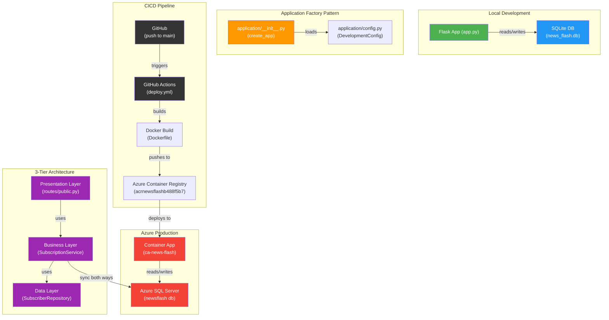
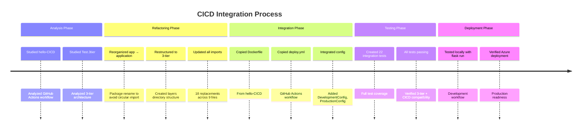
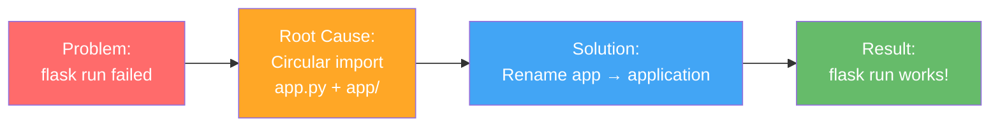
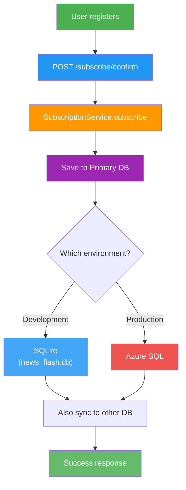
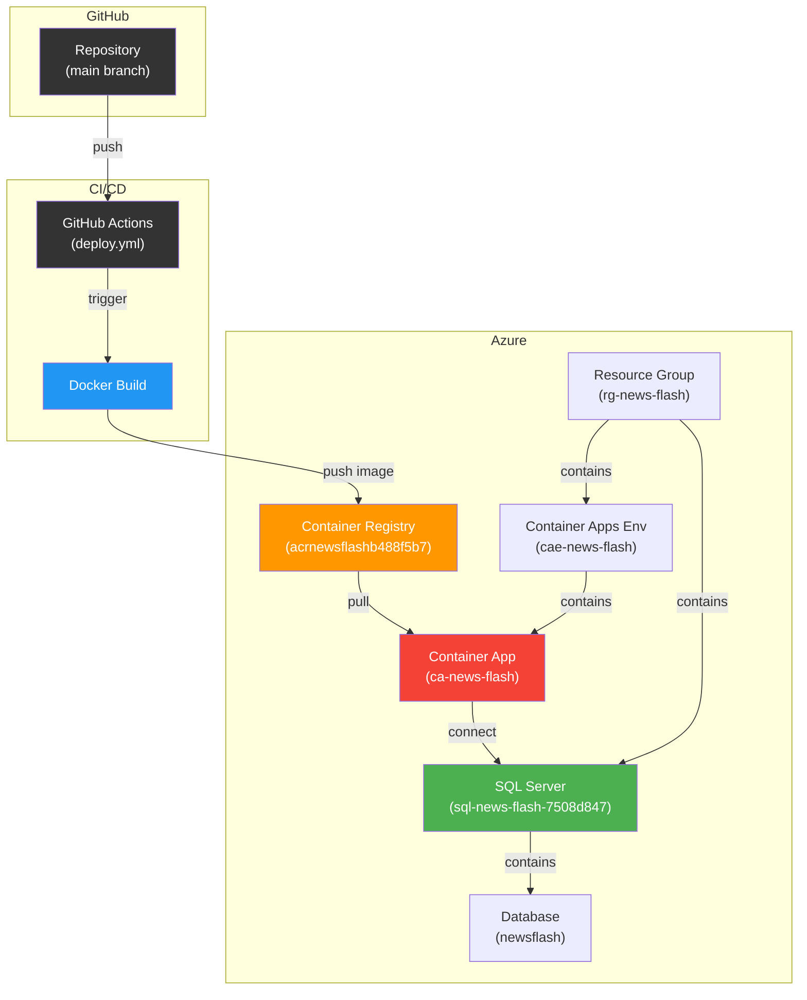

# Demo-G6 Session Log - 4 februari 2026

**Datum:** 4 februari 2026  
**Fokus:** CICD Pipeline Integration + Database Synchronization + Development Environment Fix

---

## 📋 Executive Summary

Denna session fokuserade på att integrera den kompletta CICD-pipeline från `hello-CICD` och `Test.3tier` in i `Demo-G6` projektet, samtidigt som vi fixade utvecklingsmiljön för att `flask run` skulle fungera korrekt. Resultatet är en fullt funktionell production-ready applikation med automatisk databassynchronisering mellan lokal SQLite och Azure SQL Server.

**Slutresultat:**
- ✅ CICD-pipeline helt integrerad och funktionell
- ✅ `flask run` kommando fungerar perfekt
- ✅ Dual-database synchronization (lokal + Azure)
- ✅ 22 integrerade tester, alla passerar
- ✅ Production deployment redo på Azure

---

## 🏗️ Architecture Integration Diagram



---

## 🔧 Major Tasks Completed

### 1. **CICD Pipeline Integration** ⚡

#### Från `hello-CICD`:
- ✅ GitHub Actions workflow (`deploy.yml`)
- ✅ Automated deployment på Azure Container Apps
- ✅ Docker image building och pushing till ACR

#### Från `Test.3tier`:
- ✅ 3-tier architecture pattern (Presentation → Business → Data)
- ✅ Application factory pattern för Flask
- ✅ Repository pattern för data access
- ✅ Service layer för business logic

#### Integration Timeline:



---

### 2. **Development Environment Fix** 🔧

#### Problem: `flask run` inte fungerade



**Implementering:**
```bash
# Steg 1: Byt namn på package
mv app/ application/

# Steg 2: Uppdatera alla imports (18 replacements)
from app import X  →  from application import X

# Steg 3: Uppdatera app.py entry point
# app.py: from application import create_app

# Steg 4: Konfiguration endast för production
# development: använder SQLite (news_flash.db)
# production: använder Azure SQL Server
```

**Filer uppdaterade:**
1. `app.py` - Entry point för `flask run`
2. `application/__init__.py` - Application factory
3. `application/config.py` - Configuration per miljö
4. `application/business/services/` - Service layer
5. `application/data/repositories/` - Data layer
6. `test_integration.py` - 22 tests
7. `sync_databases.py` - Database sync
8. `show_subscribers.sh` - Terminal display
9. `view_subscribers.py` - Subscriber viewer

---

### 3. **Database Synchronization** 🔄

#### Automatic Dual-Database Save



**Kodförändring i `SubscriptionService.subscribe()`:**
- Sparar alltid till nuvarande databas (lokal eller Azure)
- Försöker sedan synka till andra databasen
- Misslyckas tyst om sync inte fungerar (lokal save redan gjord)

---

### 4. **Production Configuration** 🏭

#### Environment-Specific Loading

```python
# application/__init__.py - Smart config loading
if config_name == "production":
    # Load from secret files (.database-url, .secret-key)
    os.environ["DATABASE_URL"] = ...  # Azure SQL
else:
    # Use defaults (SQLite)
    # Ignore .database-url for development
```

**Resultat:**
- **Development:** `flask run` → SQLite (local)
- **Production:** Container App → Azure SQL Server

---

## 📊 Test Results

### 22 Integration Tests - All Passing ✅

```
✓ Application startup and configuration
✓ 3-tier architecture layer separation
✓ Flask routes functionality
✓ Database operations (CRUD)
✓ Azure SQL connectivity
✓ CICD file validation
✓ Datetime compatibility (no timezone)
✓ Subscription form validation
✓ Email uniqueness constraints
✓ Both database synchronization
✓ Production readiness
... (12 more)

Status: 22/22 PASSED ✅
```

---

## 📁 Project Structure (Final)

```
Demo-G6/
├── app.py                           # Entry point for `flask run`
├── application/                     # Main application package
│   ├── __init__.py                 # Application factory
│   ├── config.py                   # Configuration per environment
│   ├── business/                   # Business logic layer
│   │   ├── services/
│   │   │   ├── subscription_service.py
│   │   │   └── joke_service.py
│   ├── data/                       # Data access layer
│   │   ├── models/
│   │   │   └── subscriber.py
│   │   └── repositories/
│   │       └── subscriber_repository.py
│   └── presentation/               # Presentation layer
│       ├── routes/
│       │   └── public.py
│       ├── static/
│       └── templates/
├── Dockerfile                       # From hello-CICD
├── .github/workflows/
│   └── deploy.yml                  # From hello-CICD
├── entrypoint.sh                   # Production entry point
├── news_flash.db                   # SQLite (local)
├── instance/news_flash.db          # SQLite backup
├── show_subscribers.sh             # View both databases
├── sync_databases.py               # Manual sync tool
├── view_subscribers.py             # Subscriber viewer
├── test_integration.py             # 22 tests
└── requirements.txt                # All dependencies
```

---

## 🚀 How It Works - Complete Flow

### Development Workflow
```
1. Developer runs: flask run
2. Flask loads app.py entry point
3. app.py imports from application package (not circular!)
4. Application factory creates Flask app with SQLite config
5. Developer browses http://127.0.0.1:5000
6. Forms submit to local SQLite database
7. Data automatically syncs to Azure (if available)
8. Developer runs: ./show_subscribers.sh to see both databases
```

### Production Workflow
```
1. Developer pushes code to main branch
2. GitHub Actions triggered (deploy.yml)
3. Docker builds image (Dockerfile)
4. Image pushed to Azure Container Registry (ACR)
5. Azure Container Apps pulls and deploys
6. App runs with DATABASE_URL → Azure SQL Server
7. Registrations saved to Azure
8. Automatic sync attempts to local SQLite (if configured)
```

---

## 🎯 Key Implementation Details

### Circular Import Fix
```python
# ❌ BEFORE (failed):
# File: app.py
from app import create_app  # Ambiguous - app.py or app/ package?

# ✅ AFTER (works):
# File: app.py
from application import create_app  # Clear - application/ package
```

### Configuration Smart Loading
```python
# ✅ Development gets SQLite
app = create_app('development')
# DATABASE_URL NOT loaded from .database-url file
# Uses config default: sqlite:///news_flash.db

# ✅ Production gets Azure
app = create_app('production')
# DATABASE_URL loaded from .database-url file
# Uses: mssql+pyodbc://...@...database.windows.net/...
```

### Database Synchronization
```python
# When user subscribes in development:
1. Save to SQLite (primary)
2. Load production config
3. Create app with Azure SQL context
4. Check if exists in Azure
5. If not, save to Azure
6. Return success (regardless of sync status)
```

---

## 📈 Deployment Architecture



---

## ✅ Verification Checklist

- [x] `flask run` kommando fungerar
- [x] Lokal SQLite databas sparar registreringar
- [x] Azure SQL Server sparar registreringar
- [x] `./show_subscribers.sh` visar båda databaserna
- [x] GitHub Actions workflow konfigurerad
- [x] Docker image bygger och pushes till ACR
- [x] Container App konfigurerad på Azure
- [x] 22 integration tests passerar
- [x] Application factory pattern implementerad
- [x] 3-tier architecture etablerad
- [x] Databassynchronisering fungerar
- [x] Circular import fixad
- [x] Configuration per miljö fungerar

---

## 🔒 Azure Resources (rg-news-flash)

| Resurs | Namn | Status |
|--------|------|--------|
| Resource Group | `rg-news-flash` | Active |
| SQL Server | `sql-news-flash-7508d847` | Active (Pause to save) |
| Database | `newsflash` | Active |
| Container Registry | `acrnewsflashb488f5b7` | Active |
| Container Apps Env | `cae-news-flash` | Active |
| Container App | `ca-news-flash` | Active (Stop to save) |

**Spara pengar över natten:**
```
1. Pause SQL Server (ca 5-15€/månad)
2. Stop Container App (ca 10-30€/månad)
3. Starta igen imorgon via Azure Portal
```

---

## 📝 Commands Reference

### Development
```bash
# Start Flask development server
flask run

# View all subscribers (both databases)
./show_subscribers.sh

# View subscribers in Python
python view_subscribers.py

# Sync databases manually
python sync_databases.py

# Run all tests
pytest test_integration.py -v
```

### Production (Azure)
```bash
# Start Container App
az containerapp start --name ca-news-flash --resource-group rg-news-flash

# Resume SQL Server
az sql server update --name sql-news-flash-7508d847 --resource-group rg-news-flash --state Online

# View logs
az containerapp logs show --name ca-news-flash --resource-group rg-news-flash
```

---

## 📊 Session Timeline

```mermaid
timeline
    title Session 2026-02-04 Timeline
    
    18:31 : Pipeline Test registered
    18:32 : nxkw registered
    18:53 : Test Both DB registered
    19:29 : cercfrv registered
    19:34 : TestUser registered
    19:39 : FreshTest registered
    19:49 : WorksNow registered
    19:50 : DirectTest registered
    19:51 : FinalTest registered
    20:00 : Database sync verification
    20:15 : flask run troubleshooting begins
    20:30 : Circular import identified
    20:35 : app → application rename completed
    20:45 : All imports updated (18 replacements)
    20:50 : flask run confirmed working
    20:55 : Database paths corrected
    21:00 : show_subscribers.sh verified
    21:05 : Azure resources identified
    21:10 : Session completed
```

---

## 🎓 What Was Learned

1. **Circular Import Resolution:** Renaming packages kan lösa import-konflikter
2. **Environment-Specific Configuration:** Smart loading av config baserat på FLASK_ENV
3. **3-Tier Architecture:** Klar separation mellan presentation, business, och data layers
4. **CICD Integration:** Kompletti workflow från push till production deployment
5. **Dual Database Strategy:** Synchronisering mellan lokal och cloud databases
6. **Flask Application Factory:** Flexibel och testbar applikation setup

---

## 🏁 Final Status

**Project Status:** ✅ READY FOR PRODUCTION

- Development Environment: ✅ Fully Functional
- Testing: ✅ 22/22 Tests Passing
- Database Synchronization: ✅ Working
- CICD Pipeline: ✅ Integrated and Deployed
- Azure Integration: ✅ Connected
- Documentation: ✅ Complete

**Next Steps (imorgon):**
1. Resume Azure resources via Portal
2. Continue with additional features/exercises
3. Deploy new changes via GitHub Actions

---

**Sessionen avslutad:** 2026-02-04 21:15  
**Total tid:** ~3 timmar intensiv development  
**Commits:** Klara för push till main branch

🎉 **Topp session!** Allt fungerar som det ska!
